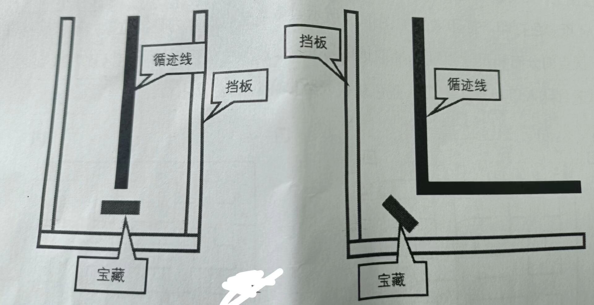

# 2023guangshe
 
# T 核心文件说明
## T.0 raspberry/main_program
树莓派的主要代码，包括了地图识别，路径规划，巡线等 
### T.0.0 model
放paddle模型的
### T.0.1 YYJ
比较久之前做的python树莓派整合库，有些简单的视觉部分
### T.0.2 move.py
移动控制的python库、主要是串口发送数据到下位机
### T.0.3 test_in_main.py， test_print_elder.py
使用的主函数,后面的是使用print看路径模拟测试使用的。
### T.0.4 util
#### T.0.4.0 servo.py
使用子线程树莓派控制舵机云台
#### T.0.4.1 mine_classify.py
宝藏分类，具体使用了paddle的分类模型。里面有历程。实测**1m可以做到准确分类**
#### T.0.4.2 LCD_2inch4.py
LCD 屏幕显示图片库（保证可以直接小车看得到摄像头反馈，方便**独立**地图识别）
#### T.0.4.3 get_map.py
宝藏识别，做了归一化处理，实测1比10极限长宽拉伸仍然可以识别。 
四角定位裁剪后矫正，得到二值化的一个地图（这个后面**路径规划需要使用**，可做**随机地图路径规划**） 
#### T.0.4.4 map_rec.py, get_pathx(x是1到4)
前面提到转换后的二值化图像，使用map_rec转换成21乘以21的矩阵提高路劲规划运行速度 
归一化之后可以进行路径规划 返回固定格式的移动代码。 
ps: 这里一大堆get_path是临近比赛临时很多需求，具体的底层是一样的 
由于进行了归一化，**随机地图也能识别和规划路径**（地图大小和生成规则不变的前提下，10 乘以10个格子）。 
大概的思路就是把地图当成一个10乘以10的大方块，里面有n多个小方块。由于四角定位剪切完后归一化除以一个10，逐行逐列取中点进行“扫描”黑线 最后把这些有无黑线的信息拼起来就是一个完整的地图了。 
#### T.0.4.5 其他文件
都是一些显示相关的，不是核心部分。
## T.0.5 stm32
### T.0.5.0 main_new
最开始的三轮小车驱动板工程。使用的MCU为**stm32f103C8T6** 
包括的功能有。PWM控制电机、串口与上位机通信、mpu6050硬件读取、角度积分旋转、OLED显示
### T.0.5.1 main_RET6
四麦轮控制驱动板工程，使用的MCU为**stm32f103RCT6** 
包括的功能有但不限于： 
PWM控制电机 
串口与上位机通信 
mpu6050硬件读取、 
角度计算（**位置PID角度环**、仅GZ累加） 
20路GPIO输入 
四路编码器脉冲计数配置 
中断读取脉冲数计算速度（**增量PID速度环**） 
编码器解算**移动距离** 
互补滤波解算移动距离（MPU6050、可调） 
增量式PID距离环（可调） 
ps：由于后期开发时间紧急，代码有些混乱，见谅

# T.1 个人的比赛思路分享
## T.1.0 非全向移动车模
非全项移动车模相对较为简单开发，本人认为几个可以优化的点： 
①转弯的速度（使用陀螺仪简单积分一下就行） 
③碰撞宝藏后的回头，如果实测车模较重不会因为倒下的宝藏影响太大车身的位置直接撞完使用陀螺仪闭环掉头即可 
④识别**不需要走到跟前**。本开源项目实测树莓派paddle分类模型（背景简单，直接分类 爆塞数据），仅仅8w张图片就可以做到1m还能稳定分类（达到了三个格子摆放的距离了）
## T.1.1 全向移动车模
平移确实相对比较难做，但是理论上线极高，本人认为几个可以优化的点： 
①**使用云台**就可以做到看四个方向的宝藏，好好利用不需要旋转的天然优势，全称都不进行旋转 
②通过编码器加速度计混合外部输入（例如灰度）达到又快又稳定判断路口。(具体可以看看智能车视觉组) 
在这种情况下就不需要逐个路口（平移有很多路口也只看了最后的那一个）判断，只需要给出所需要的距离 到达距离附近阈值使用外部中断查看是否到达预计位置。 

# 0.区赛总体流程汇总
## 0.0 出发前
### 0.0.0 选择队伍
根据群里说的和之前提问之类的，应该是在识别地图前知道了<b>队伍</b> 
此时考虑程序开始前一直<b>“死循环</b> 直到知道了队伍后按键进行选择（依然保持 按一下不动等一段时间是A队伍，按下之后再按一下就是B队伍的逻辑）
### 0.0.1 地图识别
根据细则已经群里的反馈，大概率是这时候开始就不允许再物理按键输入之类的操作了 
所以需要选择队伍之后摄像头一直读取，读取到对的要有LCD显示反馈 
（这里由于显示文字没弄并且还需要字体库很麻烦，直接平板写字截屏，显示对应的文字图片）
#### 0.0.1.0 成功识别地图
显示识别后的地图并且显示一张文字图片<b>【识别成功】</b>
#### 0.0.1.1 显示倒计时
这个阶段主要用于将小车放到出发点，用于矫正陀螺仪已经整体初始化之类的操作 
显示的时间倒是具体定，以time.sleep(1)的频率显示 倒计时图片
#### 0.0.1.2 路径规划
识别完成地图需要完成路径规划，规划前显示一个<b>【路径规划中】</b> 
规划完成后显示<b>【路径规划完成】</b>
#### 0.0.1.3 保存地图坐标点（用于打断后继续寻宝）
保存到一个同目录（或者某个路径）一个txt,以备需要使用中断后重新开始寻宝 （不去已经找过的点了）
### 0.0.1 出发前校准
此时已经完成了地图识别，路径规划，需要进行一些校准操作 
比如mpu6050，编码器（需要考虑红色蓝色出发点会不会导致灰度“误识别”） 
此时LCD显示校准中，校准完成后显示校准完成
### 0.0.2 按键按下出发
此时显示图片<b>【按下出发】</b>，按下后小车就正常开始走了
## 0.1 出发后
小车路径上存在的优化有： 
①同一个象限内的宝藏一定是两种颜色，如果看过一个自己颜色宝藏，那另一个宝藏就不需要去了 
②己方宝藏总计四个，三个真宝藏一个假宝藏，如果识别到了三个真宝藏就不需要去寻找下一个点了
③如果己方已经找过三个自己颜色宝藏了并且知道最后一个是己方的颜色。这时候不需要识别一定是真的直接撞 
需要注意的是宝藏放置有一定的规则，如下图所示: 

## 0.2 
# X. 测试汇总记录
## X.1 整体流程
- [x] 1. 按键选择队伍 
    使用按键选择队伍（长按与按下再松开），LCD辅助提示

- [x] 2. 识别宝藏图 
    LCD显示图像进行辅助提示，使用按键识别图像并显示识别后的二值化图像 
    如果识别有问题在进行二值化显示识别结果确认时候进行长按重新识别.

- [X] 3. 根据坐标完成路劲规划 
    根据得到的宝藏坐标进行路劲规划并进行一系列处理输出标准格式的指令

- [X] 4. 进行巡线完成任务 
    根据指令执行并完成巡线
  

## X.2 需要解决的问题
- [x] 1. 宝藏分类问题 
    存在将蓝色圆形识别成几次蓝色三角之后全是别成不存在宝藏的问题 

- [x] 2.路劲规划优化 
    在一个象限内找到宝藏后，另外一个宝藏显然就不是需要去的了， 
    可以进行寻找下一个象限宝藏的寻找了 

- [x] 3.宝藏方向问题
    拐角处的两个宝藏朝向不确定（校赛说了朝向入口，先解决这个先）。 
    需要考虑宝藏不一定朝着哪个方向的问题（除非细则有详细说明）。

## X.3 bug汇总
### X.3.1 csi摄像头bug
问题描述：再断电后上电会出现无法读取csi摄像头问题 
解决方法：在上电前请不要插入USB摄像头，在上电后打开即可

### X.3.3 USB摄像头宝藏分类bug
问题描述：在多次调用函数 classify_treasure(team="red")时，会出现无法初始化摄像头问题 
解决方法：初始化摄像头进行五次尝试，如果不行直接返回该宝藏为假宝藏并结束函数

### X.3.3 PID巡线容易在转弯后异常break
问题描述：转弯后车子处于不稳定状态摄像头读取画面也许有问题可能回触发break 
解决方法：利用一个参数将PID巡线控制【在巡线一定时间后】才能触发break

### X.3.4 车子在开始进入宝藏区可能会偏离曲线
问题描述：由于没有陀螺仪闭环+三轮车有一个万向轮导致有几率出发的时候就歪了车头 
解决方法：在开始前把车子往前推一小段”缕一缕"万向轮位置，然后再开始
